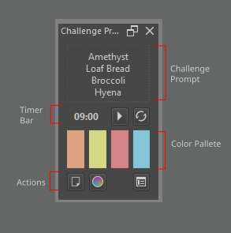
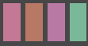
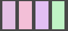
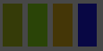

# Challenge Prompt Maker

A plugin for [Krita](https://krita.org).

## What is Challenge Prompt Maker? 

*Challenge Prompt Maker* is a docker that  generates drawing challenge prompts 
from a customizable list of categories along side a four slot color palette in split complementary color scheme. 
The plugin uses HSV to generate the color pairing.

---

## ScreenShots 

### *Interface*

 

### *The plugin is fairly small and consist of 4 parts;* 

1. The Challenge Prompt Area
2. The Timer Area
3. The Color Palette Slot
4. The Action Buttons

*Note 1: At start the color palette slot starts as gray blocks*

*Note 2: Buttons will not respond until a canvas is created*

### *Interface Individual Parts*

1. Challenge Prompt Area - The challenge text prompt appear here
2. Countdown Timer  - Shows how many minute left in the challenge. 
3. Start/ Paus Timer Button - Start and pauses 
4. Reset Timer Button - Reset the coundown timer
5. Main Color - The main color generated, all other color are generated based on this color
6. Right Color Complement - The right analagous color of main color, base on HSV wheel, 15° to 40° to the left of main
7. Left Color Complement  - The left analagous color of main color, base on HSV wheel, 15° to 40° to the right of main
8. Complementary Color    - The complementary color of main color, base on HSV wheel, 170° to 190° from main
9. Generate Challenge     - Generates the Challenge Prompt 
10. Generate Color Palette - Generates Color Palette
11. Configuration - Opens Configuration Dialog 

### *Configuration Dialog*

The configuration dialog allows the customization and control of the randomization settings. 
Configuration is available for color odds and ranges, timer setting to categories and items.

### *Parts of Configuration Dialog*

The configuration has more parts than the main plugin. 

1.  **Roll Count** : The number of randomization round. (Limit: 1 to 4)
2.  **Timer Limit** : Number of minutes of the countdown timer. (Limit: 1 to 1800)
3. **Saturation Odds and Ranges** : settigns for controlling the saturation odds and range of the generated random color.
    1.  **Saturation Odds** : Changes the odds to favor a range of saturation 
    2.  **Saturation Ranges**  : Set up the ranges of saturation points
4. **Value Odds and Ranges** : settigns for controlling the value odds and range of the generated random color.
    1. **Value Odds** : Changes the odds to favor a range of value 
    2. **Value Ranges** : Set up the ranges of value points
5. **Categories and Slots**
    1. **Slot Selection** : Selects a Slot to load the active category under it
    2. **Category List** : List all available category, and checks the active one for a given slot.
        1. Right Clicking on a selected item in category list will show context menu to activate editing it. 
    3. **Add/ Edit Text Box** : Enter text to add/ edit a category.
    4. **Add/ Edit Button** : Triggers the command to add or edit the category.
    5. **Delete Button** : Delete a selected category 
6.  **Item List**
    1. **Category Selection : Select a Category to load item under it.
    2. **Item list : List all item under the selected category.
        1. Right Clicking on a selected item in will show context menu to activate editing it. 
    3. **Add/ Edit Text Box : Enter text to add/ edit an item.
    4. **Add/ Edit Button** : Triggers the command to add or edit the item.
    5. **Delete Button** : Delete a selected item
7. **Random/ in Sequence Toggle**: Toggles between random slot selection or in sequence slot selection  
8. **Ok** : Saves the changes made in the dialog
9. **Cancel** : Discards the changes made in the dialog.

### *Value and Saturation Ranges Control*

1. Low Saturation/Value Box : Sets the lowest possible value / saturation of the color generated can have.
2. Mid Saturation/Value Box : Marks the end point of Low sat/val range and start point of Mid sat/val range
3. High Saturation/Value Box : Marks the end point of Mid sat/val range and start point of High sat/val range
4. Saturation/Value Limit Box: Sets up the highest possible value / saturation of the color generated can have.

### *Value and Saturation Odds Control*

1. More Low Saturation/Value Color - Skew the odds of generated more color to generate more low saturation or value color.
2. More Mid Saturation/Value Color - Skew the odds of generated more color to generate more mid saturation or value color.
3. More High Saturation/Value Color - Skew the odds of generated more color to generate more high saturation or value color.
4. Normal Distribution - Attempts to distribute odds based on Normal Bell curve.
5. Equal Distribution  - Make the odds of generating low, high, mid saturation/value equal .

**Odds Distribution**

| Odds Skew | %Low | %Mid | %High |
|-----------|-----|-----|------|
| More Low  | 90  |  5  |  5   |
| More Mid  | 5   | 90  |  5   |
| More High | 5   | 5   |  90  |
| Normal    | 14  | 72  |  14  |
| Equal     | 33  | 34  |  33  |

- Even if the odds is skewed to low there is still 10% chance of getting color with higher saturation/value. 

**Sample Color Palette Generated**

|           | Low Sat | Mid Sat | High Sat |
|-----------|-----|-----|------|
| Low Val   |  |   |   |
| Mid Val   |  |   |   |
| High Val  |  |   |   |

- Note that color generated in each level is also dependent on the range setup as low, mid, high. 

### Functionalities

This plugin main function  are;

1. Generate text prompt 
2. Generate a color pallete along side text prompt, and on its own.  
3. Generate a color pallete along side text prompt, and on its own.  

If the global pressure setting is off, then this plugin pressure setting will also be off. 

[Video Challenge Prompt Maker in Action](https://drive.google.com/file/d/1ADQ_XU4Yjgyn-OUfrI9FJOPRlLT3hJeI/view?usp=sharing)

### Notes
 - This plugin utilizes HSV color model in  generating color. 
 - This plugin stores items, categories and settings in JSON files. It is possible to edit the settings and category/ item by editing these files.  
 - Limit for slots is hard coded to be at max 4.
 - Limit for color box is 4, only 4 color is generated based on the splitcomplementary color scheme.

### Plans 
 - Adding manual editing of color chances

### Bugs and Known Issues
 

## Downloads - Install - Execute 

### Download
- **[ZIP](https://github.com/kaichi1342/ChallengePromptMaker/archive/refs/heads/v.0.1.0.zip)**
- **[Source](https://github.com/kaichi1342/ChallengePromptMaker)**

### Install

1. Open [Krita](https://krita.org)
2. Got to Tools -> Scripts -> **Import Python Plugins** and select 

**ChallengePromptMaker.zip** archive. 
3. Restart [Krita](https://krita.org)
4. Make sure Challenge Prompt Maker is enabled in Plugin Manager. 
if not enable it by going to Settings -> Configure Krita -> **Python Plugin Manager** and click to check **Challenge Prompt Maker**.
5. Restart Krita.
6. View **Challenge Prompt Maker** to your screen by going to Settings -> Dockers -> **Challenge Prompt Maker**

### Tested Platforms
- Krita 5.1.1 

### Release Log

2022-10-09  : Version 0.1.0
- First Released Version  
  
## License

### *Challenge Prompt Maker* is released under the GNU General Public License (version 3 or any later version).

*Challenge Prompt Maker* is free software: you can redistribute it and/or modify 
it under the terms of the GNU General Public License as published by
the Free Software Foundation, either version 3 of the License, or
(at your option) any later version.                               
    
*Challenge Prompt Maker* is distributed in the hope that it will be useful,
but WITHOUT ANY WARRANTY; without even the implied warranty of
MERCHANTABILITY or FITNESS FOR A PARTICULAR PURPOSE.
See the GNU General Public License for more details.

You should have received a copy of the GNU General Public License
along with this program. If not, see https://www.gnu.org/licenses/                                   

                            
 
